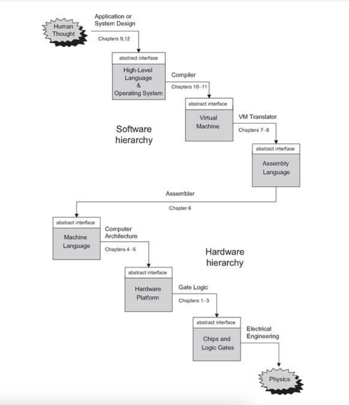

---

[Nand2Tetris Website](https://www.nand2tetris.org/course)

---

# Quick Reference

### 2's complement table

```
0000 0
0001 1
0010 2
0011 3
0100 4
0101 5
0110 6
0111 7
1000 -8 (8)
1001 -7 (9)
1010 -6 (10)
1011 -5 (11)
1100 -4 (12)
1101 -3 (13)
1110 -2 (14)
1111 -1 (15)
```

### Subtracting 5-3

Subtracting (b) from (a) is same as adding (-b) to (a).

5-3 == 5+(-3)

```
   0101 (5)
 + 1101 (-3)
   ----
 1 0010 --> (2)
 - 
```

### Computing (-x)

**Input**: x<br>
**Output**: -x (in 2s complement)<br>

**Idea**: (2^n)-x = 1+((2^n)-1)-x

We know that for 8 bit number, (2^n)-1 = (2^8)-1 = 255 = 11111111

It is very easy to subtract a number from 11111111, because you never need to borrow any number.

```
   11111111
 - 10101100
   --------
   01010011
```
Once the above step is done, just add 1,<br>

```
   01010011
 + 00000001
   --------
   01010100
```

Another example, given 4, find -4.<br>
4 = 0100

We know that (2^n)-1 = 16-1 = 15 = 1111.

Subtract 0100 from 1111.

```
   1111
 - 0100
   ----
   1011
```
Add 1 to above result,

```
   1011
 + 0001
   ----
   1100
```

1100 corresponds to -4.